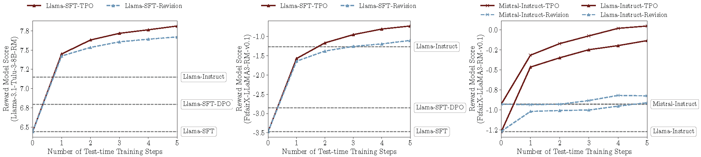

# Test-Time Preference Optimization (TPO)

        

This repository contains the official code for the paper [Test-Time Preference Optimization: On-the-Fly Alignment via Iterative Textual Feedback](https://arxiv.org/abs/2501.12895).
<!-- (https://arxiv.org/abs/XXX). -->


## 🔔 News
<!-- - **[20/01/2025]** Our paper is released on arXiv: https://arxiv.org/abs/XXX. -->
- **[23/01/2025]** Our paper is released at [https://arxiv.org/abs/2501.12895](https://arxiv.org/abs/2501.12895).
- **[20/01/2025]** Our code is open-source! We are working on the paper and will release it very soon.


## 👀 About TPO

We introduce Test-time Preference Optimization (TPO), a novel framework designed to align large language models (LLMs) with human preferences during inference without updating model parameters. TPO operates by translating reward signals into textual critiques and using these critiques as textual rewards to refine the model's responses iteratively, thereby enhancing alignment with human preferences.

<p align="center">  <br></p>


<!-- For more details, you can check our paper [here](https://arxiv.org/abs/XXX). -->

## 📈 Performance

**Benchmark Performance**

Our evaluations demonstrate that TPO enhances alignment with human preferences across a range of tasks, including instruction following, preference alignment, safety, and mathematics.  Benchmark results reveal that both unaligned and aligned models experience significant improvements after just a few TPO iterations.  Remarkably, the unaligned Llama-3.1-70B-SFT model outperforms the well-aligned `Llama-3.1-70B-Instruct` model on nearly all benchmarks.

| Model                                   | AlpacaEval 2 LC(%)| AlpacaEval 2 WR(%)| Arena-Hard | HH-RLHF | BeaverTails | XSTest  | MATH-500 |
|-----------------------------------------|-------------------|-------------------|------------|---------|-------------|---------|----------|
| LLaMA-3.1-70B-DPO                       | 32.3              | 23.1              | 50.4       | -2.8    | -6.7        | 89.8    | 63.4     |
| LLaMA-3.1-70B-Instruct                  | 36.9              | 34.9              | 59.0       | -0.5    | -6.4        | 88.7    | 66.4     |
| LLaMA-3.1-70B-SFT                       | 27.8              | 16.8              | 44.1       | -4.1    | -7.2        | 87.8    | 61.8     |
| w/ TPO (D2-N5) †                        | 33.2              | 39.5              | 70.5       | 0.1     | **-4.1**    | 89.8    | 70.0     |
| w/ TPO (D2-N5) *                        | 33.0              | 40.5              | 69.7       | -0.6    | -4.8        | **90.4**| 71.2     |
| w/ TPO (D5-N20) *                       | **37.8**          | **55.7**          | **77.5**   | **0.4** | **-4.1**    | 89.6    | **71.8** |

| Model                      | AlpacaEval 2 LC(%) | AlpacaEval 2 WR(%) | Arena-Hard | HH-RLHF | BeaverTails | XSTest  | MATH-500 |
|----------------------------|--------------------|--------------------|------------|---------|-------------|---------|----------|
| Llama-3.1-70B-Instruct     | 36.9               | 34.9               | 59.0       | -0.5    | -6.4        | 88.7    | 66.4     |
| w/ TPO (D2-N5) *           | 39.1               | 48.5               | 69.5       | **1.3** | -3.6        | 89.6    | **71.6** |
| Mistral-Small-Instruct-2409| 45.7               | 38.5               | 53.8       | -0.4    | -5.2        | 87.1    | 57.6     |
| w/ TPO (D2-N5) *           | **53.4**           | **60.5**           | **72.2**   | 1.1     | **-3.4**    | **90.7**| 62.2     |

These table highlights the performance gains of models after applying this approach, outperforming its baseline. Here, `D` refers to the maximum number of iterations, and `N` refers to the number of samples. `*` denotes the models optimized with TPO using the reward model `FsfairX-LLaMA3-RM-v0.1`, while `†` denotes `Llama-3.1-Tulu-3-8B-RM`.

**Test-time Training**

<p align="center">  <br></p>

The figure shows that all models gradually align with the reward model during the TPO process. The colored lines represent models with test-time training, while the dashed lines represent those without. Additionally, we include a *revision* baseline, which iteratively refines the best cached response without considering rejected ones, thereby ignoring preference signals that indicate which responses are good or bad.

## ⚙️ Environment Setup
Follow the steps below to set up your environment: 

1. **Create a Virtual Environment:**

   ```bash
   conda create -n tpo python=3.10
   conda activate tpo
   ```

2. **Download and Install Dependencies:**
   ```bash
   git clone https://github.com/yafuly/TPO.git
   cd TPO
   pip install -r requirements.txt
   ```

3. **Install TextGrad:**
   ```bash
   cd textgrad-main
   pip install -e .
   cd ..
   ```

## 💬 TPO Setup

By default, the TPO framework runs in a single-machine, single-GPU environment. The **vLLM server** is deployed using 4 GPUs in a tensor-parallel setup, and 1 GPU is utilized for generating the responses. The flow is as follows:

1. **Setup vLLM Server**

   This server hosts the model that will be optimized with TPO. To deploy the vLLM server, use the following command:
   ```bash
   vllm serve allenai/Llama-3.1-Tulu-3-70B-SFT --dtype auto --api-key token-abc123 --tensor-parallel-size 4 --port 8000
   ```

   For more information or additional configurations on starting the vLLM server, please refer to the official vLLM [documentation](https://docs.vllm.ai/en/latest/getting_started/quickstart.html#openai-compatible-server).


2. **Start TPO**

   Run the following command to execute the TPO script, which runs a reward model to interact with the policy model deployed as the vLLM server:

   ```bash
   python run.py \
      --data_path data/sample.json \
      --ip $IP \
      --port 8000 \
      --server_model server-allenai/Llama-3.1-Tulu-3-70B-SFT \
      --reward_model sfairXC/FsfairX-LLaMA3-RM-v0.1 \
      --tpo_mode tpo \
      --max_tokens_response 2048 \
      --max_tokens_all 8192 \
      --sample_size 5 \
      --seed 7 \
      --max_iterations 2 \
      --num_threads 4
   ```

   Main parameters:
   - `data_path`: Path to the data file (JSON). Refer to `data/sample.json` for more details.
   - `ip`: Server IP address of the vLLM server, e.g., `localhost` or `127.0.0.1`.
   - `port`: Port number for the vLLM server, e.g., `8000`.
   - `server_model`: Base model used for serving via an API, e.g., `server-allenai/Llama-3.1-Tulu-3-70B-SFT` or `server-/mnt/models/reward_model/Llama-3.1-Tulu-3-70B-SFT`.
   - `reward_model`: Identifier or path for the reward model, e.g., `sfairXC/FsfairX-LLaMA3-RM-v0.1` or `/mnt/models/reward_model`.
   - `sample_size`: Number of responses to sample for each step (default: 5).
   - `max_iterations`: Max number of test-time optimization iterations (default: 5).
   - `num_threads`: Number of threads to use for generation. Increasing the `num_threads` can lead to faster generation by utilizing multiple processing cores simultaneously, thus **improving efficiency**. Set to 1 for limited computational resources.

   For more parameters, please refer to the `run.py` file.

   Upon running the script, log files will be generated in the `logs/` directory, stored in JSON format for easy parsing and analysis. Each iteration of the TPO optimization process captures four key items, all directly related to the large model: 
    - Input and output during the textual loss calculation, comparing the chosen and rejected responses.
    - Input used to generate gradients.
    - Output as the textual gradient.
    - Iterative Optimization input, used for the next round of response generation. This structure allows for detailed tracking of the optimization process at each iteration.

**Multi-Machine, Multi-GPU Setup**: If deploying the vLLM server on multiple machines with multiple GPUs, ensure you obtain the IP address of the vLLM server and use it in the `--ip` parameter. This allows the script to generate responses by querying the vLLM server running on a different machine. Ensure that both machines are connected to the same network and the server is accessible via the specified IP.


## 📝 Citation

```
@misc{li2025testtimepreferenceoptimizationonthefly,
      title={Test-Time Preference Optimization: On-the-Fly Alignment via Iterative Textual Feedback}, 
      author={Yafu Li and Xuyang Hu and Xiaoye Qu and Linjie Li and Yu Cheng},
      year={2025},
      eprint={2501.12895},
      archivePrefix={arXiv},
      primaryClass={cs.CL},
      url={https://arxiv.org/abs/2501.12895}, 
}
```

## 🌹 Acknowledgements

We thank the authors of [TextGrad](https://github.com/zou-group/textgrad) for their foundational contributions to the textual feedback. We also acknowledge the use [vLLM](https://github.com/vllm-project/vllm) for generation.
